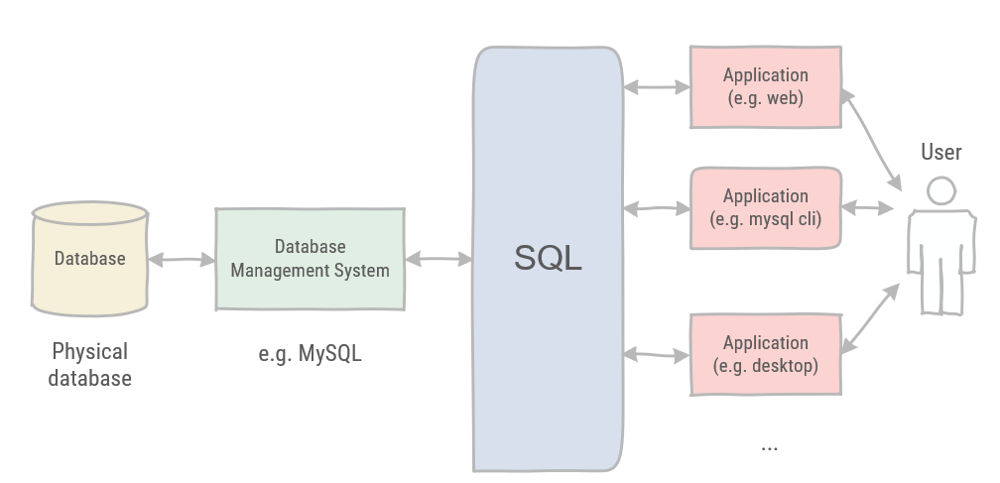

# Inleiding tot Databanken

## Wat is een databank?

Het woord databank wordt op veel manieren gebruikt. Voor ons doel hanteren we de volgende definitie:

> Een databank is een verzameling gegevens die op een georganiseerde manier is opgeslagen.

Je kunt een databank zien als een soort archiefkast. Het is simpelweg een fysieke locatie om gegevens op te slaan, ongeacht wat deze gegevens zijn of hoe ze zijn opgeslagen.

### DataBase Management System - DBMS

De term `databank` verwijst niet naar de database-software die wordt gebruikt. Dit kan veel verwarring veroorzaken als het niet correct wordt gebruikt. De _database-software_ wordt het Database Management System of DBMS genoemd.

De databank is de container die wordt aangemaakt en kan worden beheerd met behulp van het DBMS. MySQL is in dit geval een DBMS-systeem, niet de fysieke databank.

Een databank kan een bestand op een harde schijf zijn, maar kan ook volledig in het geheugen worden opgeslagen. Dit is niet van belang, omdat je een databank nooit direct benadert. Je gebruikt altijd het DBMS om toegang te krijgen tot de databank.

Figuur 1: Database en DBMS

## Tabellen

Bij het opslaan van informatie in een archiefkast gooi je het niet zomaar in een lade. Je maakt bestanden binnen de kast. Gerelateerde gegevens worden in specifieke bestanden geplaatst.

In de databankwereld wordt een bestand een tabel genoemd. Een tabel is een _gestructureerd bestand_ waarin gegevens van een specifiek type kunnen worden opgeslagen. Een tabel kan een lijst van klanten, een productcatalogus of een andere lijst met informatie bevatten.

Figuur 2: Archiefkast

Bij het gebruik van tabellen in een databank moeten deze aan bepaalde regels voldoen. Tabellen die niet aan de volgende beschrijving voldoen, kunnen niet in een databank worden opgeslagen en moeten worden gereorganiseerd:

- Rijen bevatten gegevens over een entiteit
- Kolommen bevatten gegevens over de attributen van die entiteit
- Alle invoer in een kolom is van hetzelfde type
- Elke kolom heeft een unieke naam
- Cellen van een tabel bevatten slechts één waarde
- De volgorde van kolommen is niet belangrijk
- De volgorde van rijen is niet belangrijk
- Geen twee rijen mogen identiek zijn

Het belangrijkste is dat gegevens die in een tabel worden opgeslagen van _één type_ zijn of een lijst vormen. Je zou nooit een lijst met klanten en een lijst met bestellingen in dezelfde database-tabel moeten opslaan. Technisch gezien is dit mogelijk, maar het zou het opvragen en beheren van informatie erg moeilijk maken. Een betere oplossing is om twee tabellen te maken voor elke lijst.

Elke tabel in een databank heeft een naam die deze identificeert. De naam is altijd uniek binnen een bepaalde databank.

**Klantentabel**:

| Naam | E-mail | Adres | Stad | Provincie |
| --- | --- | --- | --- | --- |
|  |  |  |  |  |
|  |  |  |  |  |
|  |  |  |  |  |

Tabel 1: Een voorbeeld van een klantentabel

### Schema's

> Rijen bevatten gegevens over een entiteit
> Kolommen bevatten gegevens over de attributen van die entiteit

Tabellen hebben kenmerken en eigenschappen die bepalen hoe gegevens erin worden opgeslagen. Dit omvat informatie over welk type gegevens mogen worden opgeslagen, hoe deze worden gestructureerd, hoe individuele stukken informatie worden benoemd en meer. De verzameling informatie die een tabel beschrijft, wordt een schema genoemd. Schema’s worden gebruikt om specifieke tabellen binnen een databank te beschrijven, evenals de relaties tussen tabellen.

### Kolommen en datatypes

> Alle invoer in een kolom is van hetzelfde type

Tabellen bestaan uit kolommen. Kolommen bevatten een specifiek stukje informatie binnen de tabel. Je kunt database-tabellen zien als roosters (zoals spreadsheets). Elke kolom in het rooster bevat een specifiek stukje informatie.

Elke kolom in een databank heeft een bijbehorend **datatype**. Dit bepaalt welk type gegevens de kolom kan bevatten.

Bijvoorbeeld: numeriek, datum, tekst, valuta,…

:::tip
Datatypes zijn erg belangrijk voor een databank. Ze beperken het type gegevens dat in de kolom kan worden opgeslagen, waardoor wordt voorkomen dat verkeerde informatie wordt opgeslagen. Ze helpen ook bij het correct en efficiënt sorteren van gegevens en spelen een belangrijke rol bij het optimaliseren van schijfgebruik.
:::

### Rijen

Gegevens in een tabel worden opgeslagen in rijen. Elke opgeslagen record wordt in een aparte rij bewaard.

Bijvoorbeeld: Een klantentabel kan één klant per rij opslaan.

Het aantal rijen in de tabel is gelijk aan het aantal records. De termen _record_ en _rij_ worden vaak door elkaar gebruikt, maar _rij_ is technisch gezien de correcte term.

### Primaire sleutels

:::warning Regel
Rijen mogen niet identiek zijn.
:::

Elke rij in een tabel moet een kolom (of set van kolommen) hebben die deze uniek identificeert. Deze kolom of set van kolommen wordt de primaire sleutel genoemd. De primaire sleutel wordt gebruikt om naar een specifieke rij te verwijzen.

Zonder een primaire sleutel wordt het bijwerken of verwijderen van specifieke rijen in een tabel erg moeilijk. Er is geen gegarandeerde veilige manier om alleen de betreffende rijen te selecteren.

:::warning Belangrijke tip
Definieer altijd primaire sleutels!
:::

Primaire sleutels zijn niet verplicht, maar het definiëren ervan maakt toekomstige gegevensmanipulatie mogelijk en beheersbaar.

Elke kolom kan als primaire sleutel worden geselecteerd zolang deze aan de volgende voorwaarden voldoet:

1. Geen twee rijen mogen dezelfde primaire sleutelwaarde hebben (uniekheid)
2. Elke rij moet een primaire sleutelwaarde hebben (NULL is niet toegestaan)

Deze regels worden afgedwongen door MySQL.

Een primaire sleutel kan uit meerdere kolommen bestaan. In dat geval wordt deze een _samengestelde sleutel_ genoemd. Wanneer meerdere kolommen worden gebruikt, gelden dezelfde regels voor alle kolommen die deel uitmaken van de primaire sleutel. Individuele kolommen hoeven niet uniek te zijn, maar de hele sleutel in combinatie moet uniek zijn.

#### Best practices voor primaire sleutels

Naast de regels die MySQL afdwingt, zijn er enkele best practices bij het kiezen van een primaire sleutel:

- Wijzig geen waarden in primaire sleutelkolommen
- Hergebruik geen waarden in primaire sleutelkolommen
- Gebruik geen waarden die kunnen veranderen in primaire sleutelkolommen

