# Het Entiteit-Relatie Model

## Inleiding

Een datamodel dat zeer geschikt is voor het ontwerpen van een database is het **Entiteit-Relatie Model (Entity Relationship Model, ER-model)**.

In het Entiteit-Relatie model wordt gebruik gemaakt van:

- **Entiteiten**
- **Attributen**
- **Relaties (relationships)**

## Voorbeeld

Een bedrijf ontwerpt een informatiesysteem ter ondersteuning van de functie "Personeel". Van de werknemers wordt volgende informatie bijgehouden:

- **Werknemersnummer**
- **Naam**
- **Geboortedatum**
- **Adresgegevens**
- **De kantoorruimte waar hij/zij werkt**
- **De gevolgde cursussen en de datum**

Niet elke werknemer volgt een cursus. De afdeling waartoe de kantoorruimte behoort, wordt ook vastgelegd. Meerdere werknemers kunnen samen één kantoorruimte delen. De cursussen hebben een cursusnummer en een -naam.

## **ER Diagram**

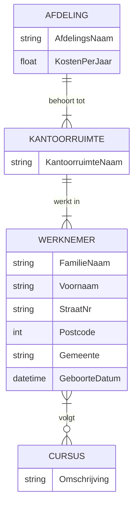

In dit diagram:

- **Werknemer** is gekoppeld aan **Afdeling** met een **1**\*\*:N\*\*\*\* relatie\*\*.
- **Werknemer** kan meerdere **Cursussen** volgen (**M**\*\*:N\*\*\*\* relatie\*\*).
- **Werknemer** werkt in een **Kantoorruimte** (**1**Een bedrijf ontwerpt een informatiesysteem ter ondersteuning van de functie "Personeel". Van de werknemers wordt volgende informatie bijgehouden:

## Entiteiten

Een entiteit is een object (een tastbaar iets), een concept, iets dat je kunt identificeren en waarvan je gegevens wilt bijhouden, zoals een **auto, persoon, magazijn, bankrekening of computer**.

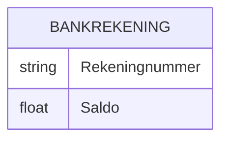

Een entiteit bestaat uit:

- Een **unieke naam**
- Een **lijst van attributen**

**Voorstelling - Voorbeeld**
Een entiteit wordt voorgesteld door een **rechthoek**.

**Voorbeelden van entiteiten in het informatiesysteem:**

- **Afdeling**
- **Kamer**
- **Werknemer**
- **Cursus**

## Relaties

Een **relatie** is een verband tussen twee of meer entiteiten.

Een relatie bestaat uit:

- Een **unieke naam** binnen het diagram
- Een **lijst van betrokken entiteiten**
- Een **lijst van attributen** (indien van toepassing)

**Voorstelling - Voorbeeld**
Een **relatie** wordt voorgesteld als een **verbindingslijn** tussen de betrokken entiteiten.

**Leesrichting:**

- **Werknemer volgt cursus**
- **Vergaderzaal behoort tot afdeling**

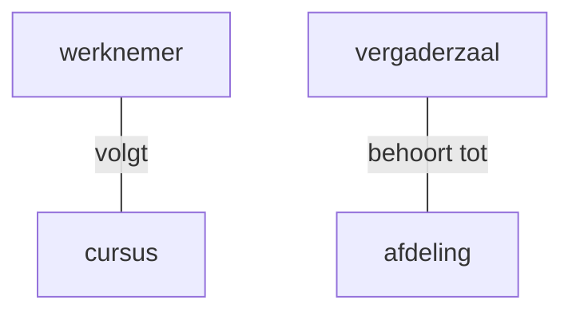
## Cardinaliteit en Optionaliteit in Databases

Cardinaliteit en optionaliteit bepalen hoe entiteiten binnen een relationele database met elkaar verbonden zijn. Cardinaliteit geeft aan **hoeveel** instanties van één entiteit gerelateerd kunnen zijn aan een andere entiteit. Optionaliteit geeft aan of een relatie **verplicht** of **optioneel** is.

### Cardinaliteitstypes

#### Één-op-één (1:1)
Bij een **één-op-één-relatie** is één instantie van entiteit A gekoppeld aan maximaal één instantie van entiteit B.

**Voorbeeld:**
- Een persoon heeft precies **één** paspoort.
- Een paspoort behoort precies **tot één** persoon.

**Mermaid ER Diagram:**
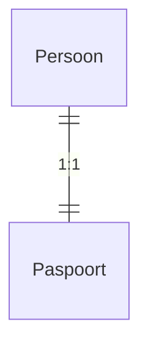

#### Één-op-veel (1:N)
Bij een **één-op-veel-relatie** kan één instantie van entiteit A gerelateerd zijn aan **meerdere** instanties van entiteit B, maar een instantie van B hoort bij slechts **één** instantie van A.

**Voorbeeld:**
- Een auteur kan **meerdere** boeken schrijven.
- Een boek heeft slechts **één** auteur.

**Mermaid ER Diagram:**
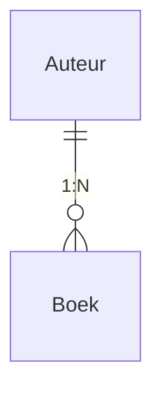

#### Veel-op-veel (M:N)
Bij een **veel-op-veel-relatie** kan een instantie van entiteit A gekoppeld zijn aan **meerdere** instanties van entiteit B, en vice versa.

**Voorbeeld:**
- Een student kan **meerdere** cursussen volgen.
- Een cursus kan **meerdere** studenten hebben.

**Mermaid ER Diagram:**
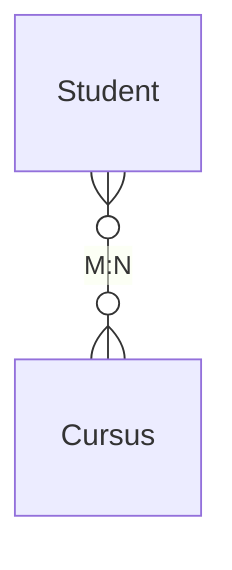

### Optionaliteit
Optionaliteit bepaalt of een relatie verplicht of optioneel is. Dit wordt vaak aangegeven met een **o** (optioneel) of een **|** (verplicht).

#### Verplichte relaties
Een verplichte relatie betekent dat een instantie van een entiteit **altijd** een gekoppelde instantie in een andere entiteit moet hebben.

**Voorbeeld:**
- Een paspoort moet **altijd** aan een persoon gekoppeld zijn (**1:1 verplicht**).

**Diagram:**
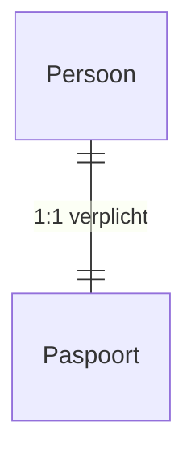

#### Optionele relaties
Een optionele relatie betekent dat een instantie van een entiteit **kan** worden gekoppeld aan een andere entiteit, maar dit is niet vereist.

**Voorbeeld:**
- Een auteur kan meerdere boeken hebben, maar een auteur **kan ook geen boeken hebben geschreven** (**1:N optioneel**).

**Diagram:**
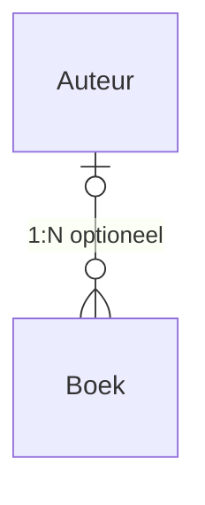

## Attributen
Een **attribuut** is een eigenschap die met de instanties van een entiteit of een relatie geassocieerd wordt.

**Attributen kunnen zijn:**

- **Voornaam, familienaam, geslacht** (bijvoorbeeld voor een **werknemer**)

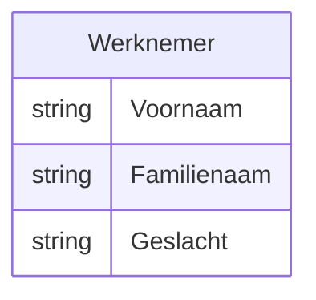

- **Cursusnummer, cursusnaam** (bijvoorbeeld voor een **cursus**)

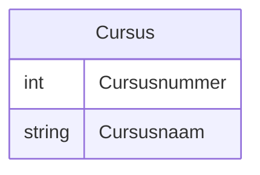

### Samengestelde Attributen
Een **naam** kan bijvoorbeeld opgesplitst worden in **Voornaam** en **Familienaam**.

In sommige gevallen heeft het **geen zin** om samengestelde attributen op te splitsen (zoals **Straat + Huisnummer**), maar in andere gevallen is dit wel nuttig.

#### Voorbeeld:
- Een adres kan bestaan uit **straatnaam, huisnummer en postcode**, wat soms als **samengesteld attribuut** wordt gezien.

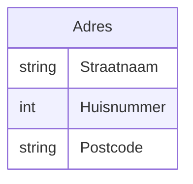

- Een volledige naam wordt vaak opgesplitst in **voornaam en familienaam**.

## Procesgegevens
Een **procesgegeven** of **berekend gegeven** is een attribuut waarvan de waarde bepaald wordt door andere attributen.

### Voorbeeld:
- **Leeftijd** kan worden berekend uit **geboortedatum** → daarom wordt alleen **geboortedatum** opgeslagen, niet **leeftijd**.

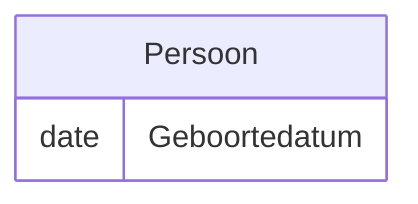

- **Totale prijs** van een bestelling wordt berekend op basis van **aantal producten en prijs per product**.

## Relaties met Attributen
De moeilijkste stap bij het opstellen van een **ERD** is het identificeren van **de attributen die bij de relaties horen**.

### Voorbeeld:
- "Van elke werknemer wordt bijgehouden **welke cursus hij wanneer volgde**"
- Hier hoort **"jaartal"** bij de relatie **"volgt"** en **niet** bij de entiteiten **"Werknemer"** of **"Cursus"**.

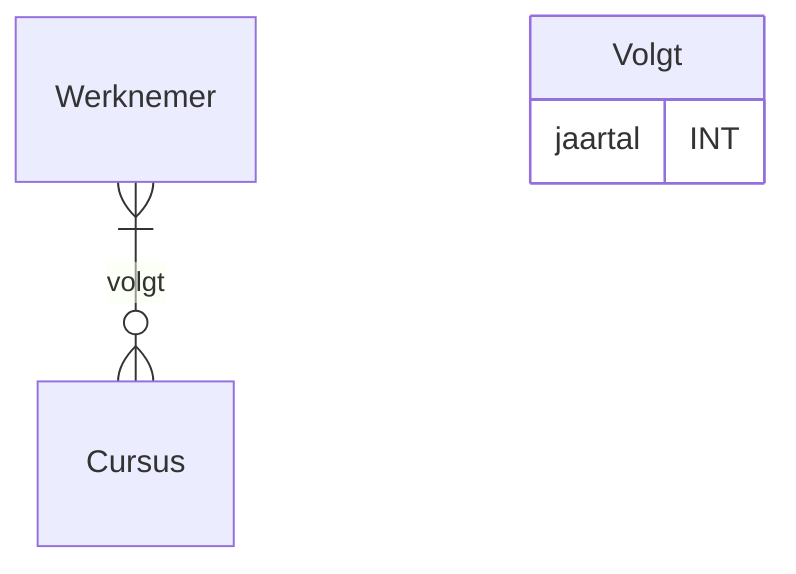

Met dit model kunnen **relationele databases** correct gestructureerd en beheerd worden.

