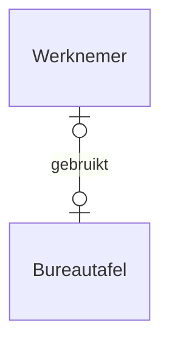
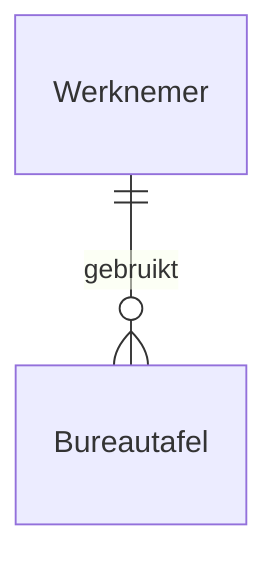
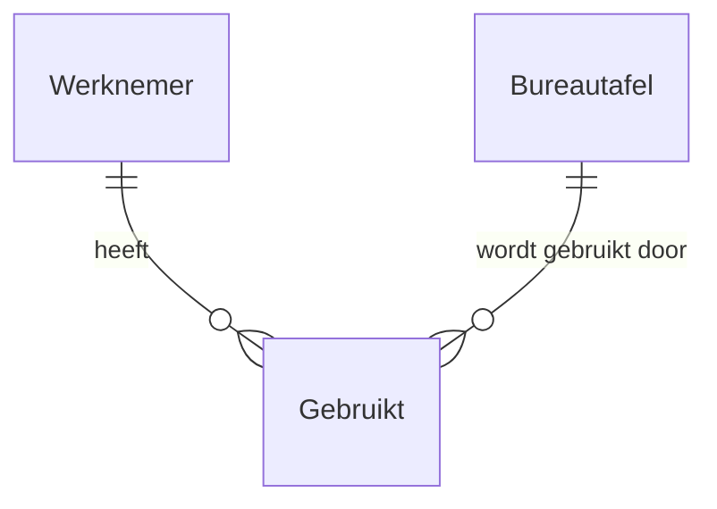
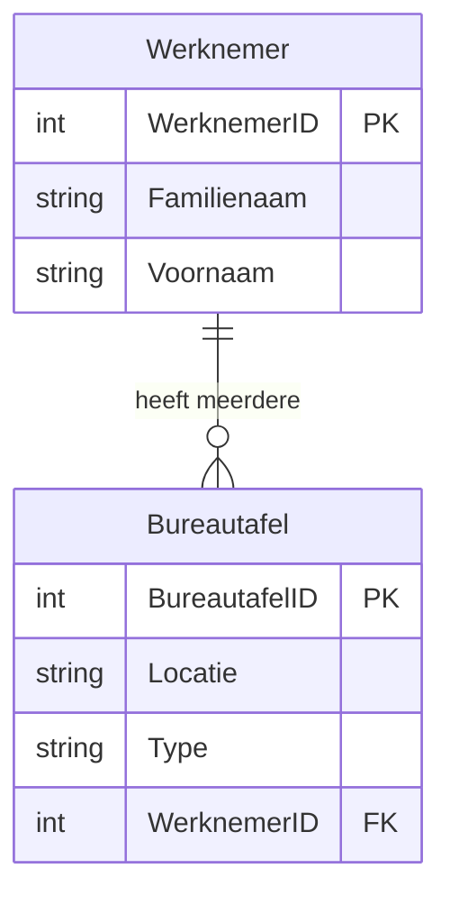

# ERD-model omzetten naar databaseontwerp

Het ERD-model moet nu omgezet worden naar een relationeel databaseontwerp. De omzetting verloopt vlot als je onderstaande regels toepast.

## Entiteiten en hun attributen

In een opgemaakt ERD-model kan je de entiteiten vertalen in tabellen. De attributen van de entiteiten worden velden van de tabellen.

## Relaties zonder attributen

### Optionaliteit

De optionaliteit van een relatie wordt omgezet tot een eventuele beperking (constraint) van de tabel. Als de optionaliteit 1 is, is de entiteit vereist, wat meestal in de RDBMS zal leiden tot het vereist stellen van de refererende sleutel in de tabel corresponderend met de andere entiteit.

### Één-op-één relatie

#### Voorbeeld
Administratieve werknemers krijgen een vaste bureautafel toegewezen op kantoor. Deze bureautafel moet met niemand gedeeld worden en iedereen krijgt slechts één bureautafel. Er kunnen werknemers zijn zonder bureautafel en bureautafels die niet gebruikt worden door werknemers.



**Tabellen:**
```plaintext
Bureautafel(BureautafelID, Locatie, Type ...)
Werknemer(WerknemerID, Familienaam, Voornaam ...)
```

#### Regel
Van elke entiteit wordt een tabel gemaakt. Je neemt in één van beide tabellen de primaire sleutel op van de andere tabel.

#### Oplossing
Elke tabel heeft een primaire sleutel. In de eerste oplossing is WerknemerID de refererende sleutel, in de tweede oplossing is BureautafelID de refererende sleutel. De relatie is een één-op-één relatie.

```mermaid
erDiagram
    Werknemer {
        WerknemerID PK
        Familienaam
        Voornaam
    }
    Bureautafel {
        BureautafelID PK
        Locatie
        Type
        WerknemerID FK
    }
    Werknemer ||--o| Bureautafel : "heeft"
```

### Één-op-veel relatie

#### Voorbeeld
Beschouw dezelfde relatie als hierboven maar waarbij het mogelijk is dat een werknemer meerdere bureautafels toegewezen krijgt.



**Tabellen:**
```plaintext
Bureautafel(BureautafelID, Locatie, Type ...)
Werknemer(WerknemerID, Familienaam, Voornaam ...)
```

#### Regel
Van elke entiteit wordt een tabel gemaakt. Je voegt de primaire sleutel van de tabel langs de één-kant toe als refererende sleutel aan de tabel van de veel-kant.

```mermaid
erDiagram
    Werknemer {
        WerknemerID PK
        Familienaam
        Voornaam
    }
    Bureautafel {
        BureautafelID PK
        Locatie
        Type
        WerknemerID FK
    }
    Werknemer ||--o{ Bureautafel : "heeft meerdere"
```

### Veel-op-veel relatie

#### Voorbeeld
Beschouw weer dezelfde relatie maar breid ze verder uit door toe te laten dat éénzelfde bureautafel gedeeld wordt door verschillende werknemers.



**Tabellen:**
```plaintext
Bureautafel(BureautafelID, Locatie, Type ...)
Werknemer(WerknemerID, Familienaam, Voornaam ...)
Gebruikt(WerknemerID FK, BureautafelID FK, Datum)
```



## Overzicht

- **Relatie zonder attributen**
  - Één-op-één relatie: PS van ene tabel toevoegen als RS aan andere tabel.
  - Één-op-veel relatie: PS van de één-kant toevoegen als RS aan de veel-kant.
  - Veel-op-veel relatie: een extra tabel met beide PS.

- **Relaties met attributen**
  - Altijd een extra tabel waarin beide PS en de attributen van de relatie worden opgenomen.


  